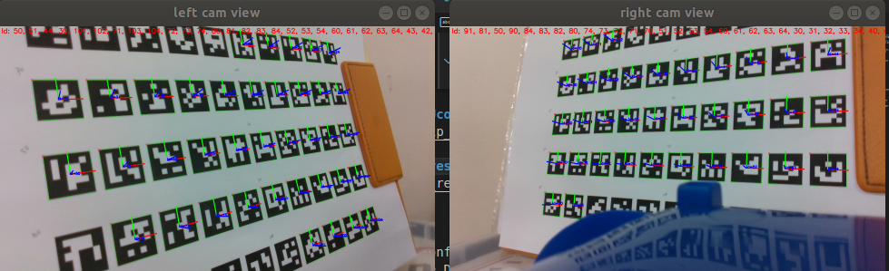

# ArucoMarkerPosture
### Experiment Setting (left, right camera, ArUco markers)


### Left, Right Camera ArUco marker detection result


## OPEN 2 Realsense <terminal 1>
self.use_self_calib_intrinsic_param =  
[True] use calibrated intrinsic parameters (/config/***.ini)  
[False] use intrinsic parameters from Realsense D435i  

```
cd ~/merchandise_stock_disposal
. devel/setup.bash
roslaunch ArucoMarkerPosture open_dual_realsense.launch
```

# TEST aruco_info service
## ROS Server <terminal 2> 
```
cd ~/merchandise_stock_disposal
. devel/setup.bash
chmod +x src/ArucoMarkerPosture/src/MarkerPosture.py
rosrun ArucoMarkerPosture MarkerPosture.py
```

## ROS Client <terminal 3> 
```
cd ~/merchandise_stock_disposal
. devel/setup.bash
chmod +x src/ArucoMarkerPosture/src/MarkerPosture_client.py

(1) Test1: if forget to request side
rosrun ArucoMarkerPosture MarkerPosture_client.py

(2) Test2: request [left] camera
rosrun ArucoMarkerPosture MarkerPosture_client.py left

(3) Test3: request [right] camera
rosrun ArucoMarkerPosture MarkerPosture_client.py right
```